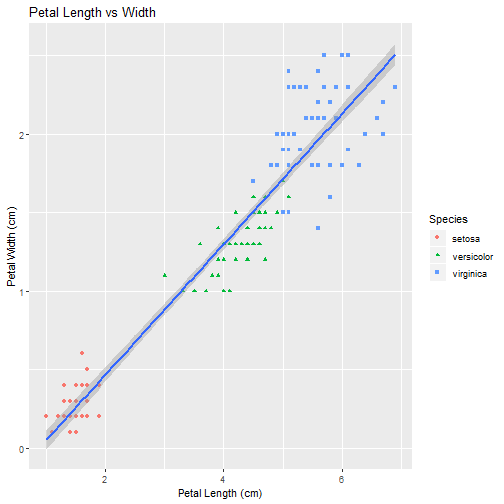
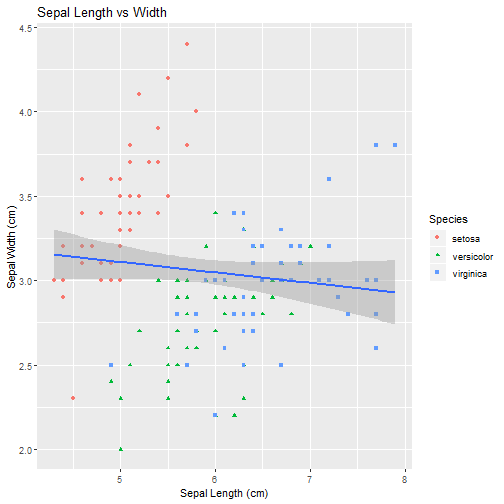

Iris Classification App - Presentation
========================================================
author: Kristina Reicher
date: January 23, 2019
autosize: true
width: 1600
height: 900

Introduction
========================================================
Iris Classification app is created for Coursera's Developing Data Products course project assigment.

This shiny app will predict iris flower species based on your input of factors:
- Sepal Length 
- Sepal Width  
- Petal Length
- Petal Width  

Documentation
========================================================
The [Iris flower data set](https://en.wikipedia.org/wiki/Iris_flower_data_set) is the most famous dataset used in statistics and data mining. It was introduced by the British statistician and biologist Ronald Fisher in mid-1930-s. The data set consists of 50 samples from each of three species of Iris (Iris setosa, Iris virginica and Iris versicolor). Four features were measured from each sample: the length and the width of the sepals and petals, in centimetres. 

I will use this data set to train prediction model using [random forest machine learning algorithm](https://en.wikipedia.org/wiki/Random_forest). The application will classify user inputted length and width for sepals and petals as one of the tree species od Iris flower.

Here is a summary of the iris data:

```
  Sepal.Length    Sepal.Width     Petal.Length    Petal.Width   
 Min.   :4.300   Min.   :2.000   Min.   :1.000   Min.   :0.100  
 1st Qu.:5.100   1st Qu.:2.800   1st Qu.:1.600   1st Qu.:0.300  
 Median :5.800   Median :3.000   Median :4.350   Median :1.300  
 Mean   :5.843   Mean   :3.057   Mean   :3.758   Mean   :1.199  
 3rd Qu.:6.400   3rd Qu.:3.300   3rd Qu.:5.100   3rd Qu.:1.800  
 Max.   :7.900   Max.   :4.400   Max.   :6.900   Max.   :2.500  
       Species  
 setosa    :50  
 versicolor:50  
 virginica :50  
                
                
                
```

Data visualization of iris data set using ggplot - part1
========================================================

```r
library(ggplot2)

ggplot(data = iris, aes(x = Petal.Length, y = Petal.Width)) +
  xlab("Petal Length (cm)") + ylab("Petal Width (cm)") +
  geom_point(aes(color = Species,shape=Species)) +
  geom_smooth(method='lm')+ ggtitle("Petal Length vs Width")
```




Data visualization of iris data set using ggplot - part2
========================================================

```r
library(ggplot2)

ggplot(data = iris, aes(x = Sepal.Length, y = Sepal.Width))+
  xlab("Sepal Length (cm)") + ylab("Sepal Width (cm)") +
  geom_point(aes(color = Species,shape=Species)) +
  geom_smooth(method='lm') + ggtitle("Sepal Length vs Width")
```



Links
========================================================
- shiny app:  https://kreicher.shinyapps.io/irisclassification/
- source code: https://github.com/KReicher/DDP
